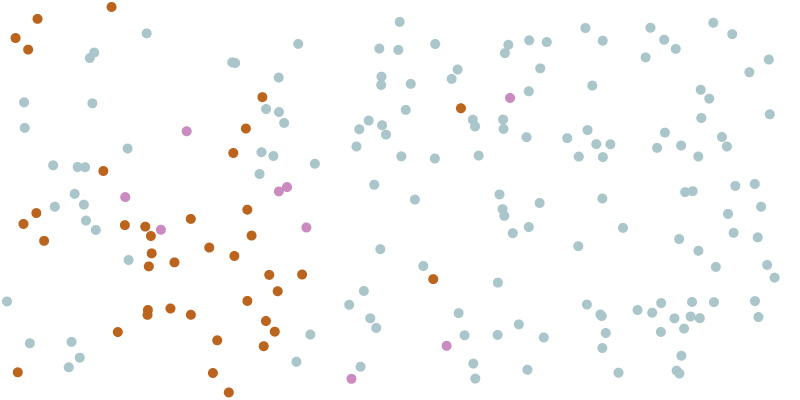

# Chapter 1

## 1. Compartmental Models in Epidemiology

## Table of Contents

* 1.1 [Basic Disease Models](ch1.md#1-1-basic-disease-models)
* 1.2 [Related Modeling Techniques](ch1.md#1-2-related-modeling-techniques)
  * 1.2.1 [Agent-based Modeling](ch1.md#1-2-1-agent-based-modeling)
  * 1.2.2 [Compartmental Models](ch1.md#1-2-2-compartmental-models)
* 1.3 [The SIR Model](ch1.md#1-3-the-sir-model)

  * [1.3.1 Motivation](ch1.md#1-3-1-motivation)
  * [1.3.2 Definitions](ch1.md#1-3-2-definitions)
  * [1.3.3 Derivation](ch1.md#1-3-3-derivation)
  * [1.3.4 In Practice](ch1.md#1-3-4-in-practice)

### 1.1 Basic Disease Models

Disease modeling is quite complex. To begin with, it involves modeling entire populations in an ever-changing environment. Identifying which groups will contract a virus and how many people will have the virus at any given timestep is as much a computational challenge as it is a mathematical one.

However, at its very core, all disease modeling can be simplified to scenarios where some type of modeling _is_ possible—and _that_ is the beginning of infectious disease modeling.

Before starting with epispot, let's take a moment to observe simple ways to model infectious diseases—without the code and math behind compartmental models. The simplest way to do this, of course, would be through the use of simulations. For our simulations, we will need to group individuals into three categories:

| Category | Symbol | Description |
| :--- | :--- | :--- |
| Susceptible | **S** | Not yet infected with the virus |
| Infected | **I** | Infected _and_ actively spreading the virus |
| Recovered | **R** | Had the virus and are now immune and not spreading it |

Now, we define a simulation in which each 'person' is a dot moving around a screen. In the beginning, everyone except one person is susceptible. The first person with the disease is often referred to as 'Patient Zero.' This patient will now go on to infect anyone they come in contact with \(i.e. any dot in the same position as them\). After a given amount of time, each dot will recover.

An excellent example of this can be seen in this [Washington Post article by @HarryStevens](https://www.washingtonpost.com/graphics/2020/world/corona-simulator/). Although the simulation is small \(only around 200 people\), it gives a simple and intuitive feel for how a virus spreads throughout a population. Here's a sample of what it looks like:

* Blue = Susceptible
* Orange = Infected
* Pink = Recovered

### 1.2 Related Modeling Techniques

While a simulation can give us an intuitive feel for how a disease might spread, in order to actually analyze the results we're going to need _data_. And in order to get data we need an _equation_ that can accurately represent the simulation above.

Before we derive this equation, though, it's important to understand the different types of models in epidemiology. Here are the main types:

#### 1.2.1 Agent-based Modeling

Similar to the simulation we saw above, agent-based modeling is the process of using 'agents,' or some representation of people, to run a more complex simulation that will eventually give results about how a disease will spread.

Agent-based modeling, however, typically involves more complex tools than just animating dots. Most agent-based models will use population structures to model which classes of individuals will likely interact with other classes. The benefit with agent-based modeling is that it is **stochastic**. By stochastic, we mean that the model generates different results each time—just like a real epidemic. Because there is no guarantee that one person will be infected, real epidemics are indeed random. Additionally, agent-based models allow for more detailed analysis that other model types.

However, their largest downside is computational inefficiency. Agent-based models are not computationally efficient to implement, especially for large population sizes \(imagine running the simulation above with 50,000 dots—and that's just the population of a small town\).

#### 1.2.2 Compartmental Models

Compartmental models, on the other hand, offer a nice balance between computational efficiency and mathematical precision. While they don't allow for precise per-demographic information, they can give quick and accurate estimates with some very simple \(and elegant\) math.

The idea behind all compartmental models is a **compartment**. Compartments, like we saw with our simulation, are essentially categories for grouping members of a population. Compartmental models use multiple compartments to model interactions between different compartments. For example, compartmental models will track the number of people in the susceptible compartment moving into the infected compartment because they were infected. By doing this at each timestep, compartmental models can keep track of different classes of individuals and generate estimates of the number of people in each compartment at any given timestep.

The main downside with compartmental models, aside from less detailed information, is that they are **deterministic**, that is to say, the opposite of **stochastic**. Essentially, compartmental models will give the same result every time and cannot generate a probability distribution, unlike with agent-based modeling. However, their speed and efficiency more than makes up for this.

### 1.3 The SIR Model

The SIR Model, which stands for Susceptible, Infected, Recovered, is one of the most widely-used epidemiological models—it represents the simplest possible model that captures the full state of a disease outbreak through a system of ordinary differential equations.

#### 1.3.1 Motivation

The motivation for the SIR model may seem unclear at first since simulations, like those in 1.1, offer a much more visual and stochastic perspective than a system of ordinary differential equations. After all, in the simulation you can observe each individual dot and its contacts, as well as retain the stochastic nature of disease outbreaks.

While simulations are _ideal_, they lack many qualities that would be necessary for them to be used in _actual_ modeling. Firstly, they are extremely computationally expensive \(imagine running a simulation with upwards of _1 million_ dots for large cities\). Secondly, and more importantly, they lack important constructs in epidemiology \(that will be later explained in 1.3.2\) that mean that the figures produced from such models are often incorrect and less precise than traditional modeling techniques \(imagine how much more complex urban mobility is from the random movement in out simulations\).

For these reasons, we turn to compartmental models, which not only offer more precise measurements but also strip down disease modeling to its core to achieve blazing fast modeling speeds.

#### 1.3.2 Definitions

In order to boil down disease modeling to its fundamental properties, we introduce the following definitions that will prove useful in 1.3.3 where we derive the actual equations for the SIR model. Later \(in 1.3.4\), we'll discuss how to merge the following two parameters into just one for the SIR model.

**1. Beta \(β\)**

> Symbol: $$ \beta $$
>
> Definition: the average number of susceptibles that one infected will infect per unit time, assuming that everyone else in the population is susceptible.

At the beginning of an outbreak, when everyone _is_ susceptible, this parameter gives the number of susceptibles being infected by one infected per unit time. However, as people begin to get infected, beta no longer represents this quantity since an infected cannot infect another infected. At this stage in the outbreak, beta becomes a theoretical, **but still important**, quantity.

It is also worth pointing out that beta _can and does_ change during the course of an outbreak. Measures like social distancing, quarantines, and improved hygiene can reduce this quantity as infecteds come into contact with less people, and festivals and large events can increase this quantity.

**2. Gamma \(γ\)**

> Symbol: $$ \gamma$$
>
> Definition: The reciprocal of the average time it takes an infected to recover from the disease.

Gamma essentially tracks the inverse of the recovery time. In compartmental models, this is known as a _rate_—remember this, as it will come in handy later in more complex models. Higher values of gamma indicate lower recovery times and lower values of gamma indicate higher recovery times.

#### 1.3.3 Derivation

Armed with two important ideas—beta and gamma—we can now derive the system of equations behind the SIR model.

The first key insight is to create three different functions to represent the three different compartments, which are the building blocks of the SIR model. We let

$$
\begin{cases} 
S(t) = \textrm{Susceptible}\\ 
I(t) = \textrm{Infected}\\ 
R(t) = \textrm{Removed}
\end{cases}
$$

The key here is to think about the _change_ in each compartment rather the exact number of individuals in a compartment at a given time. To make things simpler, let's consider the base case: How many susceptibles does _one_ infected infect per unit time? We know that:

| Compartment | Can be infected? |
| :--- | :--- |
| Susceptible | ✅ |
| Infected | ❌ \(already infected\) |
| Removed | ❌ \(either dead—which means reinfection not possible, or recovered—assumption is that recovered patients have already fought off the disease so reinfection is also not possible\) |

^ It is worth noting here that the SIR model makes a small assumption—deaths will not affect the population structure significantly enough to change the model dynamics. We will use this fact to simplify our derivation of the equations.

The table reveals that only susceptible patients can be infected—so we need to account for the probability that one infected will meet a susceptible to infect. We also know that if everyone was susceptible, one infected would infect $$ \beta$$ individuals. Remembering that there are $$ I $$ infecteds, we can write this as:

$$
\frac{dS}{dt} = -\frac{\beta IS}{N}
$$

We use the derivative to indicate the change in the susceptible compartment per unit time, $$ S $$ to represent the number of susceptibles, and $$ N $$ to represent the total population. Note the derivative is _negative_ since these people are getting infected and _leaving_ the susceptible compartment.

The next key insight we will use to derive this system will be to note that the population must stay constant \(remember that we are assuming death does not significantly change the population structure\):

$$
S + I + R = N
$$

In order for this to be true we must have:

$$
\frac{dS}{dt} + \frac{dI}{dt} + \frac{dR}{dt} = 0
$$

So in order to balance out the negative derivative of the susceptible compartment, either the infected or recovered compartment should have a positive derivative. Since people in the susceptible compartment cannot recover or die without first being infected, we know that the infected compartment must have the inverse derivative of the susceptible compartment.

$$
\frac{dI}{dt} = -\frac{dS}{dt} = \frac{\beta IS}{N}
$$

However, we also know that people move from the infected compartment into the removed compartment at the rate $$ \gamma $$. Therefore we must also have

$$
\frac{dI}{dt} = \frac{\beta IS}{N} - \gamma I
$$

Lastly, since this last group of people are moving into the removed compartment, to ensure that the population is stable we must have

$$
\frac{dR}{dt} = \gamma I
$$

Putting all of this together yields the system of ordinary differential equations:

$$
\begin{cases} 
S(t) = -\frac{\beta IS}{N}\\
I(t) = \frac{\beta IS}{N} - \gamma I\\
R(t) = \gamma I
\end{cases}
$$

That's it! These equations now form the basic SIR model. However, while the base SIR model provides us with a tool for studying how many people are _infected_ over the course of an outbreak, we can easily expand this model to include more compartments that can track _hospitalizations_, _deaths_, and other metrics.

#### 1.3.4 In Practice

To explore how we can expand this model, we'll consider a simple extension of the SIR model: the S-_E_-IR model, where the _E_ stands for _Exposed_. In this model we can not only track the number of people infected but also the number of people who _have_ the disease but cannot spread it yet. In epidemiology, the lag between exposure \(having the disease\) and infectiousness \(spreading the disease\) is known as the _incubation period_.

Let's let $$ \delta $$ represent the incubation period in our model. Remember that, similarly to $$ \gamma $$, it helps to use the reciprocal of the incubation period, specifically $$ \frac {1}{\textrm{time until infectiousness}} $$.

