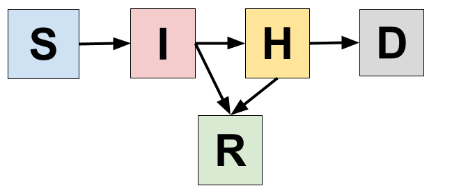
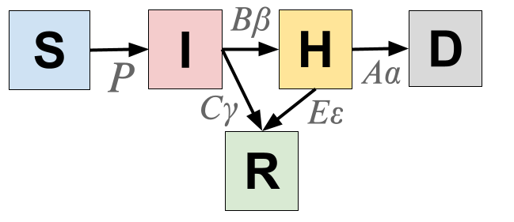
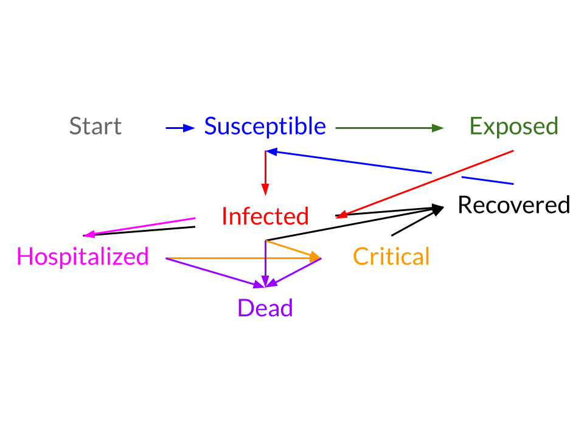
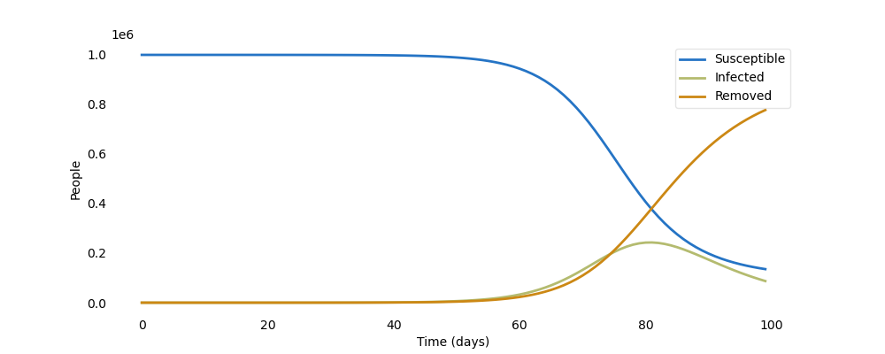
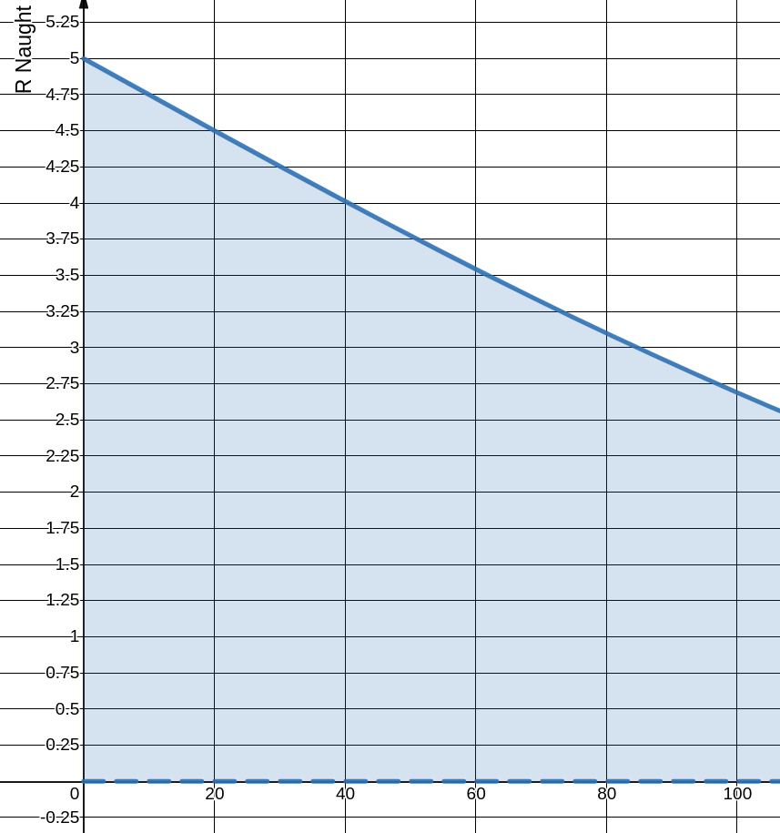
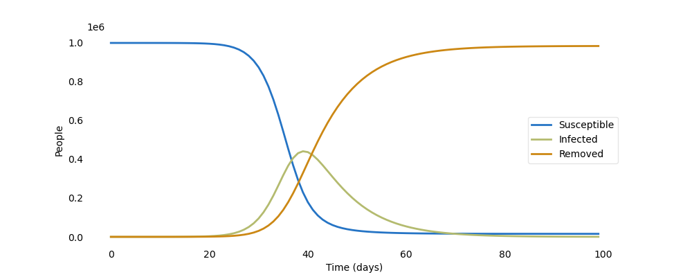
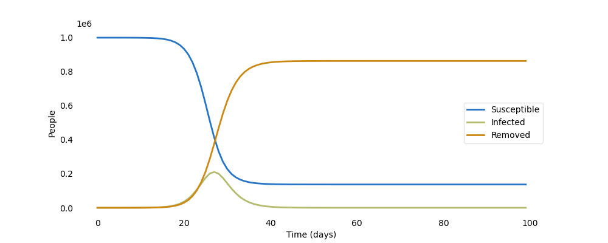
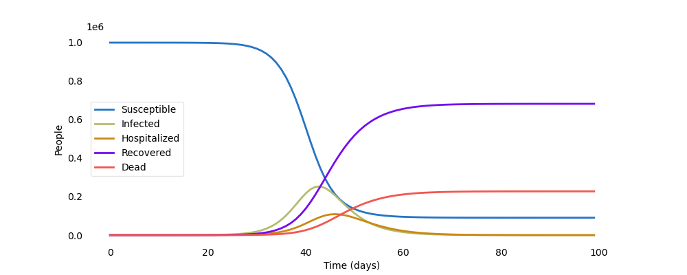

# Chapter 2

## 2. The Structure of epispot

## Table of Contents

* 2.1 [Visualizing Compartmental Models](ch2.md#2-1-visualizing-compartmental-models)
  * 2.1.1 [The SIR Model](ch2.md#2-1-1-the-sir-model)
  * 2.1.2 [Expanding Models](ch2.md#2-1-2-expanding-models)
  * 2.1.3 [More Complex Models](ch2.md#2-1-3-more-complex-models)
* 2.2 [Epispot's Layer Combination Rules](ch2.md#2-2-epispots-layer-combination-rules)
* 2.3 [Compiling Models with epispot](ch2.md#2-3-compiling-models-with-epispot)
  * 2.3.1 [The Basics: Pre-compiled Models](ch2.md#2-3-1-the-basics-pre-compiled-models)
  * 2.3.2 [Playing with the Model](ch2.md#2-3-2-playing-with-the-model)
  * 2.3.3 [Compiling the SIHRD Model](ch2.md#2-3-3-compiling-the-sihrd-model)

### 2.1 Visualizing Compartmental Models

The idea of compartmental models that we've built up in Chapter 1 is extremely useful for deriving equations, but not for really planning out the model. That is because one compartment can connect to two other compartments which can connect back to another compartment. In reality, compartmental models are complex webs of interactions between compartments. In order to truly capture this complexity, we need a way to express it.

In this chapter, we will see how to think about compartmental models visually, which will help us compile models in epispot later on. For now, we'll focus on the basic SIR model.

#### 2.1.1 The SIR Model

We start with the SIR model because it is the simplest model in compartmental modeling, with only three compartments. In order to really _visualize_ the SIR model, we need to think of each of its compartments as boxes:


The next thing to do is to fill in the equations for the arrows. Each of the arrows represents a _transfer_ of individuals from one compartment to the next. Think of the arrows as carrying people across compartments. In this view, it is easy to understand how this visualization captures the zero-derivative rule we brought up in [1.3.3](ch1.md#1-3-3-derivation):

$$
\frac {dS}{dt} + \frac {dI}{dt} + \frac {dR}{dt} = 0
$$

Because every arrow connects one compartment to another compartment, any _negative_ change in one compartment results in a _positive_ change in another one. In this sense, we can say that the SIR model is a **closed system**, like all compartmental models, since no one can _escape_ the model's compartments.

Looking back at our system of equations for the SIR model, we see:

$$
\begin{cases} 
\Delta S = -\frac{\gamma R_0 IS}{N}\\
\Delta I =  \frac{\gamma R_0 IS}{N} - \gamma I\\
\Delta R = \gamma I
\end{cases}
$$

We let each of the arrows represent a derivative. The one that connects $$ S $$ → $$ I $$ will be $$ A $$ and the one connecting $$ I $$ → $$ R $$ will be $$ B $$. We can now rewrite this system as:

$$
\begin{cases} 
\Delta S = -A\\
\Delta I =  A - B\\
\Delta R = B
\end{cases}\\
$$

$$ \textrm{where} $$

$$
\begin{cases}
A = \frac {\gamma R_0IS}{N}\\
B = \gamma I
\end{cases}
$$

Writing the system out like this would yield:


#### 2.1.2 Expanding Models

At this point, these illustrations may just seem like another way of representing what we've already accomplished with equations. After all, they don't seem to be of much help if you don't know what $$ A $$ and $$ B $$ are. But the true power of these illustrations comes from the ability to expand and understand compartmental models _without_ having to glance at long systems of equations, as we'll see in this chapter.

What we are going to do is take the diagram for the SIR model and expand it to include the Exposed compartment of the SEIR model. We first add the new compartment into our diagram:


As you can see, all we had to do was move the $$ A $$ and $$ B $$ vectors to account for the new Exposed compartment and then add a new vector $$ C $$ to account for the $$ E $$ → $$ I $$ transfer. This gives us a hint to why such illustrations are so powerful.

Another thing we can do is to classify $$ A $$, $$ B $$, and $$ C $$ as rates and probabilities. Rates are timing variables, like $$ \gamma $$, while probabilities are constants which regulate the probability of changing compartments, like the $$ \frac{S}{N} $$ part of the susceptible derivative that calculated the probability of an infected meeting a susceptible. Writing out the equations for $$ A $$, $$ B $$, and $$ C $$ gives:

$$
\begin{cases}
A = \frac{\gamma R_0IS}{N}\\
B = \gamma I\\
C = \delta E
\end{cases}
$$

We can clearly see that $$ B $$ and $$ C $$ are rates—they describe the time it takes for an individual to change compartments via the variables $$ \gamma $$ and $$ \delta $$. On the other hand, $$ A $$ describes a probability, specifically the probability of an infected meeting a susceptible, and then multiplying that by the number of people they meet, $$ \gamma R_0 $$. In the next example, we'll see how rates and probabilities come into play in more complex compartmental models.

#### 2.1.3 More Complex Models

For this example, we're going to examine how such illustrations can be used to create more complex models. We'll consider the SIHRD model, which shows how an understanding of rates and probabilities will be crucial for compiling new models. 

The SIHRD model compartments stand for

* Susceptible
* Infected
* Hospitalized
* Recovered
* Dead

Mapping out each of these compartments in our diagram and connecting them with arrows yields the following figure:



Now we can use rates and probabilities to fill in the arrows. We already know some of them. For example, the arrow connecting $$ S $$ → $$ I $$ is a probability which we have already derived. However, the arrow connecting $$ I $$ → $$ H $$ has _both_ a probability and a rate. For example, you may have a 50% chance of having to go the hospital if you contract a certain disease. However, it may take on average 7 days before your symptoms become severe enough to where hospitalization becomes necessary. That means that there are not one but _two_ variables determining whether an infected moves to the hospitalized category per unit time. In our system of equations, we would multiply both these quantities together to find the portion of infecteds becoming hospitalized each unit time. This logic gives us the following chart:



With the exception of the Susceptible → Infected arrow, each arrow has a probability and rate attached to it, with the probability in a capital letter and the rate in a lowercase Greek letter. This way of thinking of models allows us to understand how we can expand existing models and add new compartments while specifying the minimum number of variables necessary to do it. Essentially, this technique allows us to add as many compartments as we wish so long as each as its own designated probability and rate.

### 2.2 Epispot's Layer Combination Rules

As you've probably noticed in the examples above, we can't just connect any two random layers together. For example, connecting the Susceptible compartment with the Hospitalized compartment is completely illogical because in order to be hospitalized, you first must get the disease. 

Of course, there are exceptions. You may want to model susceptibles being hospitalized for another reason and getting the disease from the hospital, but this is what custom models are for. Epispot's base compartments, however, have certain rules which are best expressed in the following diagram.



As you can see, you _have_ to start in the susceptible compartment; it's the entry point to the entire loop. Next, you can either become exposed to the disease or infected with it. On becoming exposed, you _must_ become infected. However, after becoming infected, you can become hospitalized, recovered, dead, or go into a critical state \(which requires extensive resources that many hospitals only have a limited supply of\). 

Hospitalized individuals can become recovered, critical, or dead, and critical individuals can become recovered or dead. You will notice that recovery and death act as **terminal states**, meaning that once reached, there are no more compartments to go to. That is, unless, you have a _recurrent_ model in which recovered patients can become susceptible again, the last possibility in our diagram. 

### 2.3 Compiling Models with epispot

This is where we put all that we've learned into action. So far, we've built up an understanding of how compartmental models work in epispot, how compartments interact with each other, how to classify parameters, and how to derive the equations for these models. This time, however, we're going to let `epispot` do the hard work _for_ us.

Before we start, it's important to go over some terminology. First of all, in order to build an epispot model, like the SIR model, you need to _compile_ it. These models are referred to as _compiled_ because they require explicit instructions on how to create each compartment and then put them together.  

However, `epispot` comes with some built-in models which have been _pre-compiled_ for us, meaning that they are already built and ready for use. In the next section, we'll work with this type of model to create the SIR model. 

#### 2.3.1 The Basics: Pre-compiled Models

For this tutorial, fire up a terminal and install `epispot` if you haven't already. Installation instructions can be found on the [GitHub repository](https://github.com/epispot/epispot/blob/master/README.md#installation), although the easiest way to install it would be simply through `pip` with:

```text
$ pip install epispot
```

Next, create a blank `.py` file and import `epispot` with:

```python
import epispot as epi
```

Note that it's recommended that you import `epispot` with the alias `epi`. This makes it easier to call functions from `epispot` with less code. In many instances in the documentation, it is assumed that `epispot` has been imported like this.

In this tutorial, we're going to be using the `epi.pre.SIR` function to create a pre-compiled SIR model. As you can see from [the documentation](https://epispot.github.io/epispot/pre#epispot.pre.SIR), it takes 4 parameters. They are R naught, the total population, and the recovery probability and rate.


Many parameters used in disease modeling are shortened in code to avoid using unnecessary keystrokes. In `epispot` common abbreviations include:

* R naught → `R_0`
* Total population → `N`
* Probability of _foo_  → `p_foo`
* Rate of _foo  →_ `foo_rate`


It's important to note that in `epispot`, all parameters are implemented as _functions_, not just constant values. This is to account for changes to these parameters over time. For now, we'll just return constant values in our functions, but [later](ch2.md#2-3-2-playing-with-the-model), we'll play with these functions to see their effect on the model.

Let's create the following constant-valued functions:

```python
def N(t): return 1e6
def R_0(t): return 2.5
def p_recovery(t): return 1.0
def gamma(t): return 1/8
```

Each of these functions takes a mandatory parameter `t`, which represents time. For now, we won't use this parameter in the function to make things simple. After setting this up, we can now call the `epi.pre.SIR` function:

```python
SIR_Model = epi.pre.SIR(R_0, N, p_recovery, gamma)
```

This `SIR_Model` variable will hold an `epispot` `Model` class. In order to find solutions to the `Model` class, we'll call the `integrate` method. At this point, the model has already been compiled \(i.e. the system of equations needed to compute predictions has already been established\). All we need to do now is solve that system of equations. `epispot` implements an algorithm known as [Euler's method](https://en.wikipedia.org/wiki/Euler's_method) to do this. As you can see from [its documentation](https://epispot.github.io/epispot/models.html#epispot.models.Model.integrate), it takes a mandatory `timesteps` argument and an optional `starting_state` argument we'll go over in the [next section](ch2.md#2-3-2-playing-with-the-model).

The `timesteps` argument basically asks for a Python `range` object with `start` and `stop` values corresponding to the days of the outbreak that you want to model. This also determines the shape of the returned value.

```python
Solutions = SIR_Model.integrate(range(100))
```

If you run this program with

```python
print(len(Solutions))
```

you'll see that it is exactly 100 elements long. And if you add

```python
print(Solutions[0])
```

you'll see that each solution element consists of a susceptible, infected, and removed sublist. To generalize this, running

```python
print(Solutions[t])
```

will yield:

```python
[..., ..., ...]  # Susceptible, Infected, Removed on day #t
```

Now that we understand the `Model.integrate` method, we can use a shortcut to generate a visual plot of the data. To do this, **delete** the `Solutions` definition and all the code that came after it. Now, simply type:

```python
Plot = epi.plots.plot_comp_nums(SIR_Model, range(100))
# Plot.show()  # uncomment for newer versions of epispot (>2.1.1)
```

You should see a `matplotlib` plot pop up on your screen that looks something like this:



That's it! You've successfully created your first `epispot` model.

#### 2.3.2 Playing with the Model

In this section, we are only going to use the plotting feature to compare models as it is much faster and simpler. Recall that your code should currently look like this:

```python
import epispot as epi

def N(t): return 1e6
def R_0(t): return 2.5
def p_recovery(t): return 1.0
def gamma(t): return 1/8

SIR_Model = epi.pre.SIR(R_0, N, p_recovery, gamma)
Plot = epi.plots.plot_comp_nums(SIR_Model, range(100))
# Plot.show()  # necessary in newer versions of epispot
```

Generally, we will keep the total population, `N`, the same. However, one thing that _does_ change over an outbreak is R naught. Typically, R naught will slowly decrease over the course of an outbreak as stringent measures are taken to avoid unnecessary contact. We can model this with logistic growth. In fact, the equation 

$$
f(t) = \frac{10e^{-\frac{t}{100}}}{1+e^{-\frac{t}{100}}}
$$

yields a slow exponential decay from 5 to around 2.75 after 100 days. Plotting the resulting function yields the graph below:



Implementing it as our new R naught function will require changing the old function to

```python
def R_0(t):
    e = 2.71828
    return ( 10 * e ** (-t / 100) ) / ( 1 + e ** (-t / 100) )
```

Running the program again should give a plot like the following:



Notice how an increased value of 5 from 2.5 gets many more infecteds. In the last plot, the peak of the infected category was reached after around 80 days whereas in this plot, the peak is not only higher but is reached sooner. Additionally, because the value of R naught _changed_ in this example, the infected bell curve is slightly asymmetrical.

There's one more parameter that we can do this to: `gamma`. Because we have an SIR model, everyone has a 100% probability of moving to the removed compartment, however, we _can_ change the _rate_ at which they move to that compartment. Let's decrease the rate to simulate faster recovery times as hospitals learn how to treat infected patients. We can do this via a scaled version of the equation we used for R naught previously. For this example, we'll use the equation

$$
f(t) = \frac{e^{-\frac{t}{100}}}{1+e^{-\frac{t}{100}}}
$$

which starts at 0.5 and slowly approaches 1 as time progresses. In reality, it will only get to about 0.25 by the end of our graph. Changing the corresponding code to include this equation will result in:

```python
def gamma(t):
    e = 2.71828
    return ( e ** (-t / 100) ) / ( 1 + e ** (-t / 100) )
```

However, we can't run the model just yet! Because we have reduced the value of `gamma`, we also must reduce R naught. This is because now the same amount of infecteds need to infect the same amount of susceptibles in a much, much shorter window of time. Running this model without changing R naught would result in drastically unrealistic projections. For this example, we'll halve the value of R naught with:

```python
def R_0(t):
    e = 2.71828
    return ( 5 * e ** (-t / 100) ) / ( 1 + e ** (-t / 100) )
```

Plotting this gives:



Notice here how the number of infecteds is _drastically_ reduced as a result of the faster recovery times. However, roughly the same amount of susceptibles are infected. 

Now that we have successfully built and edited a model, we are ready to _compile_ a model. In the next example, we'll take a look at how we can build the SIHRD model from scratch.

#### 2.3.3 Compiling the SIHRD Model

For this example, we're going to keep everything simple and just use constants for the function values. However, if you would like to do some experimentation of your own, feel free to use the lessons learned in [2.3.2](ch2.md#2-3-2-playing-with-the-model) to add variable parameter values.

The first thing that we have to remember is the structure of the SIHRD model. If you recall from [2.1.3](ch2.md#2-1-3-more-complex-models), the diagram of the model looks something like this:


Let's start by setting this up by importing `epispot` and writing a comment which demonstrates the flow of our model \(this will come helpful later\):

```python
"""
Susceptible --> Infected --> Hospitalized --> Dead
                |            |--------------> Recovered
                |---------------------------/
"""

import epispot as epi
```

We also know we are going to need functions for each of the variables in our diagram above. To keep things simple, we are going to create one function called `place` which will just return `1/4` as a placeholder for repeated definitions of rates and probabilities. This will look like:

```python
def place(t): return 0.25
```

Next, we create functions for the total population, R naught, hospitalization probability from infected, removed probability from infected, probability of death, and probability of recovery from hospitalization. Note that for compartments that have two different pathways, like the Infected and Hospitalized compartments, the probabilities of moving across those pathways needs to add up to one. In the end, we compile this list of functions:

```python
def place(t): return 0.25
def N(t): return 1e6
def R_0(t): return 2.5
def inf_to_hos(t): return 0.5
def inf_to_rec(t): return 0.5
def hos_to_dead(t): return 0.5
def hos_to_rec(t): return 0.5
```

Now, we use an extra step known as compilation. For each compartment we want to implement, we need to create a class to _compile_ that compartment. For example, for the susceptible compartment we will call:

```python
Susceptible = epi.comps.Susceptible(layer_index=0, R_0=R_0, gamma=place, N=N)
```

The first parameter of any compartment is something called the _layer index_. It determines the order of compartments, starting with `0`, but does not affect the results. For this model, we'll order the compartments as Susceptible, Infected, Hospitalized, Recovered, Dead. Compiling all the other compartments looks like:

```python
Susceptible = epi.comps.Susceptible(layer_index=0, R_0=R_0, gamma=place, N=N)

Infected = epi.comps.Infected(layer_index=1, N=N, R_0=R_0, recovery_rate=place,
                              p_recovery=inf_to_rec, p_hospitalized=inf_to_hos,
                              hospital_rate=place)

Hospitalized = epi.comps.Hospitalized(layer_index=2, p_hos=inf_to_hos, 
                                      hos_rate=place, alpha=hos_to_dead, 
                                      rho=place, p_recovery=hos_to_rec,
                                      recovery_rate=place)

Recovered = epi.comps.Recovered(layer_index=3, p_from_inf=inf_to_rec, 
                                from_inf_rate=place, p_from_hos=hos_to_rec, 
                                from_hos_rate=place)

Dead = epi.comps.Dead(layer_index=4, alpha_hos=hos_to_dead, rho_hos=place)
```

Now, we add all of these compartments into a _Model_, which will link all of the compartments together into a single object. We start by creating the model:

```python
SIHRD_Model = epi.models.Model(init_pop=N(0))
```

Notice that the `init_pop` parameter _must_ be a constant value because it represents the _initial_ population. Now, we use the `.add_layer` method to add all the layers we've compiled:

```python
SIHRD_Model.add_layer(layer=Susceptible, layer_name='Susceptible', layer_map=[Infected])
SIHRD_Model.add_layer(layer=Infected, layer_name='Infected', layer_map=[Hospitalized, Recovered])
SIHRD_Model.add_layer(layer=Hospitalized, layer_name='Hospitalized', layer_map=[Dead, Recovered])
SIHRD_Model.add_layer(layer=Recovered, layer_name='Recovered', layer_map=[])
SIHRD_Model.add_layer(layer=Dead, layer_name='Dead', layer_map=[])
```

The first parameter is where you input the class that has been compiled. The next parameter, `layer_name` represents the type of compartment that you are adding. You **must** use the correct compartment name or the layer will not be recognized. Lastly, the `layer_map` is a list of all the layers that this layer connects to. For layers that are terminal, the map is an empty list.

Finally, we can plot the model with:

```python
Plot = epi.plots.plot_comp_nums(SIHRD_Model, range(100))
# Plot.show()  # uncomment for newer versions of epispot (>2.1.1)
```

The full code for this example should look like:

```python
"""
Susceptible --> Infected --> Hospitalized --> Dead
                |            |--------------> Recovered
                |---------------------------/
"""

import epispot as epi

def place(t): return 0.25
def N(t): return 1e6
def R_0(t): return 2.5
def inf_to_hos(t): return 0.5
def inf_to_rec(t): return 0.5
def hos_to_dead(t): return 0.5
def hos_to_rec(t): return 0.5


Susceptible = epi.comps.Susceptible(layer_index=0, R_0=R_0, gamma=place, N=N)

Infected = epi.comps.Infected(layer_index=1, N=N, R_0=R_0, gamma=place,
                              recovery_rate=place, p_recovery=inf_to_rec,
                              p_hospitalized=inf_to_hos, hospital_rate=place)

Hospitalized = epi.comps.Hospitalized(layer_index=2, p_hos=inf_to_hos,
                                      hos_rate=place, alpha=hos_to_dead,
                                      rho=place, p_recovery=hos_to_rec,
                                      recovery_rate=place)

Recovered = epi.comps.Recovered(layer_index=3, p_from_inf=inf_to_rec,
                                from_inf_rate=place, p_from_hos=hos_to_rec,
                                from_hos_rate=place)

Dead = epi.comps.Dead(layer_index=4, alpha_hos=hos_to_dead, rho_hos=place)


SIHRD_Model = epi.models.Model(init_pop=N(0))
SIHRD_Model.add_layer(layer=Susceptible, layer_name='Susceptible', layer_map=[Infected])
SIHRD_Model.add_layer(layer=Infected, layer_name='Infected', layer_map=[Hospitalized, Recovered])
SIHRD_Model.add_layer(layer=Hospitalized, layer_name='Hospitalized', layer_map=[Dead, Recovered])
SIHRD_Model.add_layer(layer=Recovered, layer_name='Recovered', layer_map=[])
SIHRD_Model.add_layer(layer=Dead, layer_name='Dead', layer_map=[])

Plot = epi.plots.plot_comp_nums(SIHRD_Model, range(100))
# Plot.show()  # uncomment for newer versions of epispot (>2.1.1)
```

Run it and _viola_, it works!



✨🍰✨ Congratulations! You are now an `epispot` wizard! You should now be able to understand epispot's documentation since you understand the basic layout of `epispot` and how to compile models. The link to epispot's documentation is: [https://epispot.github.io/epispot](https://epispot.github.io/epispot). If you have any questions or feedback, don't hesitate to [submit an issue](https://github.com/epispot/epispot/issues/new) on the GitHub repository.

