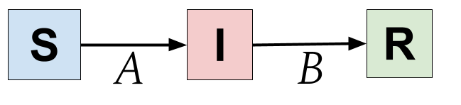
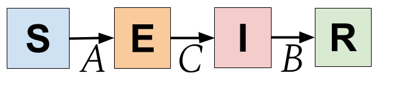

# Chapter 2

## 2. The Structure of epispot

## Table of Contents

* 2.1 [Visualizing Compartmental Models](ch2.md#2-1-visualizing-compartmental-models)
  * 2.1.1 [The SIR Model](ch2.md#2-1-1-the-sir-model)
  * 2.1.2 [Expanding Models](ch2.md#2-1-2-expanding-models)
  * 2.1.3 More Complex Models
* 2.2 Epispot's Layer Combination Rules
* 2.3 Compiling Models with epispot

### 2.1 Visualizing Compartmental Models

The idea of compartmental models that we've built up in Chapter 1 is extremely useful for deriving equations, but not for really planning out the model. That is because one compartment can connect to two other compartments which can connect back to another compartment. In reality, compartmental models are complex webs of interactions between compartments. In order to truly capture this complexity, we need a way to express it.

In this chapter, we will see how to think about compartmental models visually, which will help us compile models in epispot later on. For now, we'll focus on the basic SIR model.

#### 2.1.1 The SIR Model

We start with the SIR model because it is the simplest model in compartmental modeling, with only three compartments. In order to really _visualize_ the SIR model, we need to think of each of its compartments as boxes:

The next thing to do is to fill in the equations for the arrows. Each of the arrows represents a _transfer_ of individuals from one compartment to the next. Think of the arrows as carrying people across compartments. In this view, it is easy to understand how this visualization captures the zero-derivative rule we brought up in [1.3.3](ch1.md#1-3-3-derivation):

$$
\frac {dS}{dt} + \frac {dI}{dt} + \frac {dR}{dt} = 0
$$

Because every arrow connects one compartment to another compartment, any _negative_ change in one compartment results in a _positive_ change in another one. In this sense, we can say that the SIR model is a **closed system**, like all compartmental models, since no one can _escape_ the model's compartments.

Looking back at our system of equations for the SIR model, we see:

$$
\begin{cases} 
\Delta S = -\frac{\gamma R_0 IS}{N}\\
\Delta I =  \frac{\gamma R_0 IS}{N} - \gamma I\\
\Delta R = \gamma I
\end{cases}
$$

We let each of the arrows represent a derivative. The one that connects $$ S $$ → $$ I $$ will be $$ A $$ and the one connecting $$ I $$ → $$ R $$ will be $$ B $$. We can now rewrite this system as:

$$
\begin{cases} 
\Delta S = -A\\
\Delta I =  A - B\\
\Delta R = B
\end{cases}\\
$$

$$ \textrm{where} $$

$$
\begin{cases}
A = \frac {\gamma R_0IS}{N}\\
B = \gamma I
\end{cases}
$$

Writing the system out like this would yield:

#### 2.1.2 Expanding Models

At this point, these illustrations may just seem like another way of representing what we've already accomplished with equations. After all, they don't seem to be of much help if you don't know what $$ A $$ and $$ B $$ are. But the true power of these illustrations comes from the ability to expand and understand compartmental models _without_ having to glance at long systems of equations, as we'll see in this chapter.

What we are going to do is take the diagram for the SIR model and expand it to include the Exposed compartment of the SEIR model. We first add the new compartment into our diagram:

As you can see, all we had to do was move the $$ A $$ and $$ B $$ vectors to account for the new Exposed compartment and then add a new vector $$ C $$ to account for the $$ E $$ → $$ I $$ transfer. This gives us a hint to why such illustrations are so powerful.

Another thing we can do is to classify $$ A $$, $$ B $$, and $$ C $$ as rates and probabilities. Rates are timing variables, like $$ \gamma $$, while probabilities are constants which regulate the probability of changing compartments, like the $$ \frac{S}{N} $$ part of the susceptible derivative that calculated the probability of an infected meeting a susceptible. Writing out the equations for $$ A $$, $$ B $$, and $$ C $$ gives:

$$
\begin{cases}
A = \frac{\gamma R_0IS}{N}\\
B = \gamma I\\
C = \delta E
\end{cases}
$$

We can clearly see that $$ B $$ and $$ C $$ are rates—they describe the time it takes for an individual to change compartments via the variables $$ \gamma $$ and $$ \delta $$. On the other hand, $$ A $$ describes a probability, specifically the probability of an infected meeting a susceptible, and then multiplying that by the number of people they meet, $$ \gamma R_0 $$. In the next example, we'll see how rates and probabilities come into play in more complex compartmental models.

